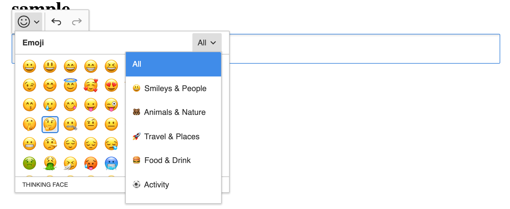

## CKEditor 5 Emoji plugin

Emoji plugin using a modified version of the ckeditor5 SpecialCharacters plugin.



### Setup

1. Installation

To install it, run:

```javascript
npm i --save @phudak/ckeditor5-emoji
```

2. Importing modules

Import the Emoji plugin with all optional categories. If you want to exclude some category, don't import it.

```javascript
import Emoji from '@phudak/ckeditor5-emoji/src/emoji';
import EmojiPeople from "@phudak/ckeditor5-emoji/src/emoji-people";
import EmojiNature from "@phudak/ckeditor5-emoji/src/emoji-nature";
import EmojiFood from "@phudak/ckeditor5-emoji/src/emoji-food";
import EmojiActivity from "@phudak/ckeditor5-emoji/src/emoji-activity";
import EmojiObjects from "@phudak/ckeditor5-emoji/src/emoji-objects";
import EmojiPlaces from "@phudak/ckeditor5-emoji/src/emoji-places";
import EmojiSymbols from "@phudak/ckeditor5-emoji/src/emoji-symbols";
import EmojiFlags from "@phudak/ckeditor5-emoji/src/emoji-flags";
```

3. Add imported modules to plugins 

Add the Emoji plugin and optional categories to CKEditor plugins.

Add plugin to build:

```javascript
InlineEditor
    .create( document.querySelector( '#editor' ), {
        plugins: [
            ...,
            Emoji,
            EmojiPeople,
            EmojiNature,
            EmojiPlaces,
            EmojiFood,
            EmojiActivity,
            EmojiObjects,
            EmojiSymbols,
            EmojiFlags,
        ],
    } )
    .then( editor => {
        window.editor = editor;
    } )
    .catch( err => {
        console.error( err.stack );
    } );
```

**or** add plugin to custom editor builder:

```javascript
InlineEditor.builtinPlugins = [
    ...
    Emoji,
	EmojiPeople,
	EmojiNature,
	EmojiPlaces,
	EmojiFood,
	EmojiActivity,
	EmojiObjects,
	EmojiSymbols,
	EmojiFlags,
]
```

4. Add the Emoji plugin to toolbar

Add plugin to build:

```javascript
InlineEditor
    .create( document.querySelector( '#editor' ), {
        plugins: [...],
        toolbar: [ ... , 'emoji' ],
    } )
    .then( editor => {
        window.editor = editor;
    } )
    .catch( err => {
        console.error( err.stack );
    } );
```

**or** add plugin to custom editor builder:

```javascript
InlineEditor.defaultConfig = {
	toolbar: {
		items: [
            ...,
			'emoji',
			'|',
			'undo',
			'redo'
		]
	},
};
```

5. Enjoy

### Emoji Set

Emoji are divided into categories:

- All
- Activity
- Food
- Flags
- Nature
- Objects
- People
- Places
- Symbols

You can choose specific categories or import all of them.


